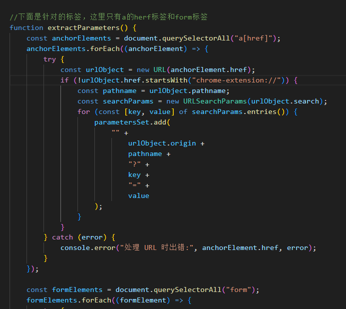
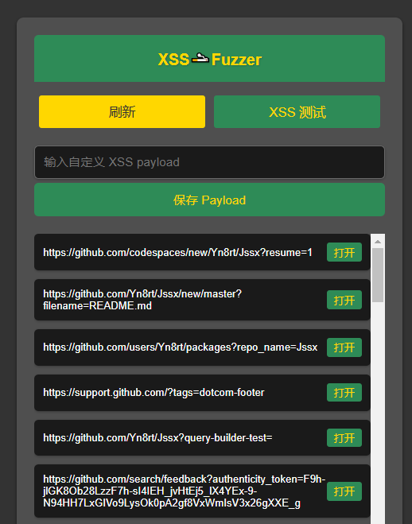

# Jssx 🚬🚬 by Yn8rt

## 写在前面

**收啥费，不收费，这也能割？**

**没事大家可以多分享一下，前几天想回去找一篇文章，结果发现撤回了，这搞的，越来越~~**😶

**有什么不足的地方希望大家及时告诉我，或者有做二次开发记得@我一下**

## 项目简介

对<a herf标签和form表单中的参数进行遍历

## 功能特性

- 根据自己提供的xsspayload进行批量测试，默认使用的是\
- 分析页面可以利用的参数：有action属性的form表单，a标签herf属性值

## 安装与使用

1. **安装插件**：将插件**文件夹**托到浏览器的扩展程序中就ok了(目前只支持chrome内核的浏览器)。
2. **使用插件**：点击浏览器工具栏中的插件图标，输入自定义payload。
3. **查看结果**：扫描完成后，插件会在弹出窗口中显示检测结果，标明发现的敏感参数。

## 开发者

该插件由 Yn8rt 开发，旨在提高网页安全性，帮助开发者及时发现并修复敏感信息泄露问题。

如需更多信息或有任何疑问，请参阅项目文档或联系开发者。